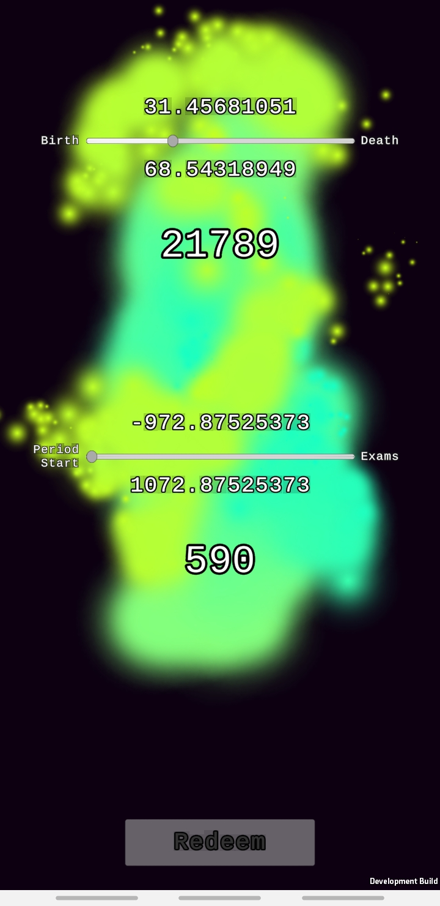

# Death Reminder
The idea is that when you are reminded of death, it is much easier to get your priorities straight. Meaning you are less likely to procrastinate, and more likely to work on the things that actually matter to you.

This app shows you how long you have to live and lets you once a day decrement the counter of how many days you have left to live. There are also some random particle animations, showing you whether you redeemed your day already.

The values are calculated based on your date of birth and an average life expectancy (that you have to provide).

Only tested for android.

